# Module 4 Assignment — Software Security
### Testing Common Web Application Vulnerabilities Using Google Gruyere
**Course:** Bachelor of Science in Computer Science  
**Unit:** Computer Security  
**Student:** Abonyo Mitchell Nina | 23/U/0095  
**Institution:** Makerere University, College of Computing and Information Sciences

---

## Repository Structure

```
GRUYERE-CODE/
├── resources/          # Static assets (CSS, images)
├── data.py             # Application data layer
├── gruyere.py          # Original Gruyere source (vulnerable)
├── gruyere_fixed.py    # Patched version with all fixes applied
├── gtl.py              # Gruyere Template Language renderer
├── README              # Original Gruyere readme
├── sanitize.py         # HTML sanitisation helpers
└── secret.txt          # Secret key used for cookie signing
```

---

## Getting Started

### Prerequisites

- Python 2.7 (Gruyere was written for Python 2; use a virtual environment or `pyenv`)
- Git

### Clone the Repository

```bash
git clone https://github.com/ninamitchell23/module4-assignment.git
cd module4-assignment
```

### Run the Original (Vulnerable) App

```bash
python gruyere.py
```

Then open your browser at:

```
http://localhost:8008/<your-instance-id>
```

A unique instance ID is printed in the terminal on startup. Use it in the URL above.

### Run the Fixed App

```bash
python gruyere_fixed.py
```

The fixed version starts on the same port. All patches are applied — you can re-run the exploits from the report and observe that they no longer work.

### Run Both Side-by-Side (Different Ports)

```bash
# Terminal 1 — vulnerable original
python gruyere.py --port 8008

# Terminal 2 — patched version
python gruyere_fixed.py --port 8080
```

---

## How to Commit Your Changes

After making edits (e.g. adding fixes to `gruyere_fixed.py` or updating the README):

```bash
# 1. Check what has changed
git status

# 2. Stage specific files
git add gruyere_fixed.py README.md

# Or stage everything
git add .

# 3. Commit with a meaningful message
git commit -m "fix: patch XSS, DoS, and cookie security vulnerabilities"

# 4. Push to GitHub
git push origin main
```

#### Suggested Commit Convention

| Prefix | When to use |
|--------|-------------|
| `feat:` | New test or exploit added |
| `fix:` | Vulnerability patched |
| `docs:` | README or report updated |
| `chore:` | Cleanup, formatting |

Example commit history:
```
fix: restrict file uploads to safe extensions (FIX-5)
fix: add HMAC-SHA256 cookie signing and HttpOnly flag (FIX-8)
fix: normalise URL paths to block case-sensitivity bypass (FIX-7)
docs: add screenshots and README for module 4 assignment
```

---

## Overview

This assignment explores common web application vulnerabilities using [Google Gruyere](https://google-gruyere.appspot.com/), an intentionally buggy web application designed for security training. The goal is to identify, exploit, and propose fixes for real-world vulnerabilities in a safe, sandboxed environment.

All tests were performed using the web-based version of Google Gruyere hosted on Google App Engine, with Mozilla Firefox and its developer tools used to inspect application behaviour, requests, and responses.

---

## Vulnerabilities Tested

| # | Vulnerability | Tested | Exploited | Fixed |
|---|---------------|--------|-----------|-------|
| 1 | Cross-Site Scripting (Stored XSS) | ✅ | ✅ | ✅ |
| 2 | Cross-Site Scripting (Reflected XSS) | ✅ | ✅ | ✅ |
| 3 | XSS via HTML Attribute | ✅ | ✅ | ✅ |
| 4 | Stored XSS via AJAX | ✅ | ✅ | ✅ |
| 5 | File Upload XSS | ✅ | ✅ | ✅ |
| 6 | Denial of Service — Quit Server | ✅ | ✅ | ✅ |
| 7 | DoS — Case-Sensitivity Bypass | ✅ | ✅ | ✅ |
| 8 | SQL Injection | ✅ | ⚠️ N/A | ✅ |
| 9 | Buffer Overflow | ✅ | ⚠️ N/A | ✅ |

> SQL Injection and Buffer Overflow were analysed conceptually. Gruyere does not use SQL and is implemented in Python, which prevents typical buffer/integer overflow exploitation.

---

## Setup

A new user account (`nina`) was created on the Google Gruyere web application. Upon registration, the system generated a unique instance ID used to access an isolated session for safe testing.

**Sign Up Page**

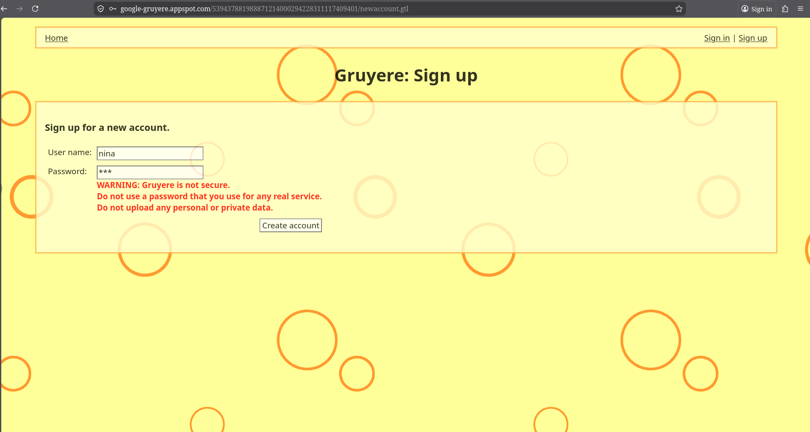  
*Figure 1: Sign Up page for user "nina" with a security warning displayed in red.*

**Account Created**

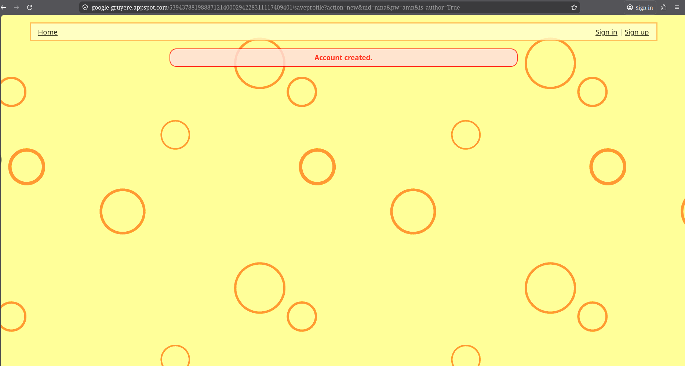  
*Figure 2: Account Created confirmation page after successfully registering.*

**Login Page**

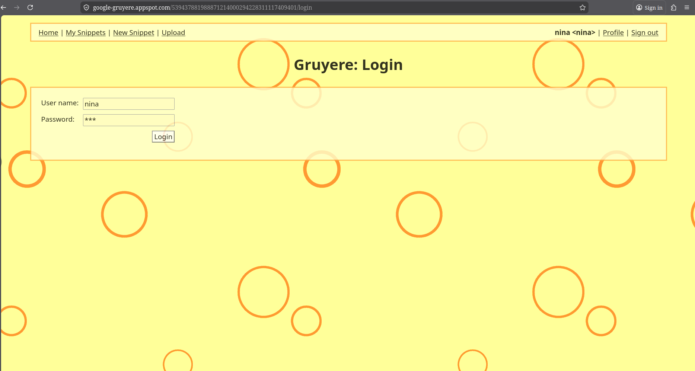  
*Figure 3: Login page with credentials entered; navigation bar confirms sign-in.*

**Start Gruyere**

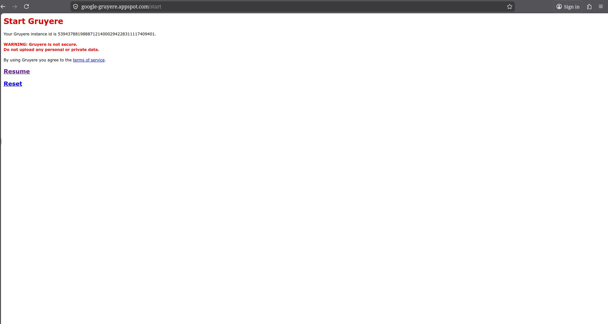  
*Figure 4: Start Gruyere page showing the instance ID and session options.*

---

## 1. Cross-Site Scripting (XSS)

Cross-site scripting (XSS) allows an attacker to inject code — typically HTML or JavaScript — into web pages viewed by other users. When a victim visits such a page, the injected code executes in their browser, bypassing the same-origin policy and potentially stealing private data.

### 1.1 Stored XSS

The attacker stores a malicious payload in the application (e.g. in a snippet). Any user who loads that page triggers the attack.

**Exploit:** ``  
**Result:** A popup appears when the page loads.  
**Fix:** Escape all user input before rendering it in the page. Strip HTML tags server-side before storage.

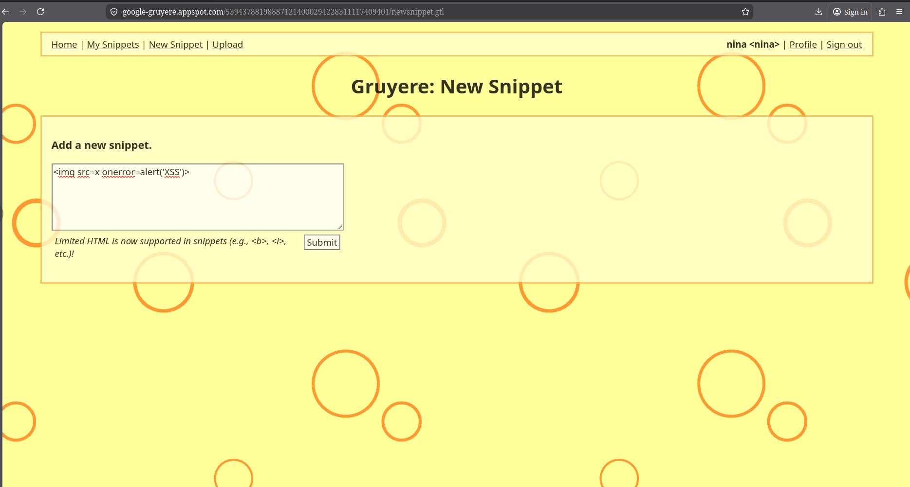  
*Figure 5: XSS payload entered in the New Snippet form.*

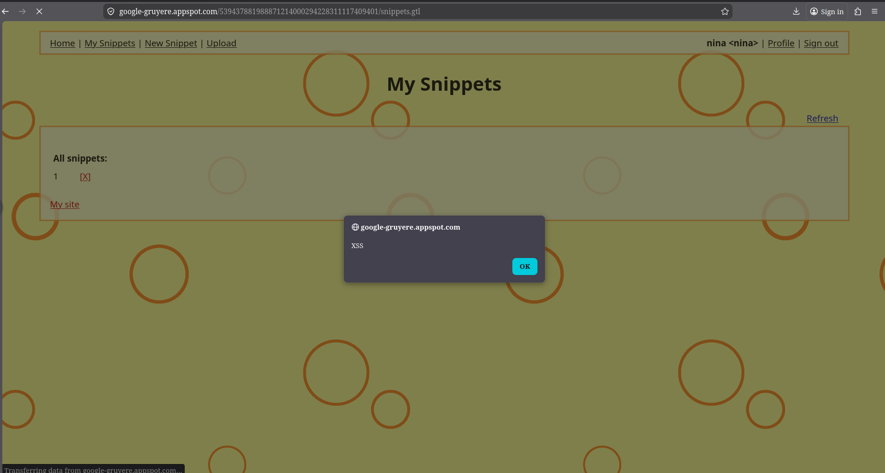  
*Figure 6: Browser alert "XSS" triggered on the My Snippets page — stored XSS confirmed.*

---

### 1.2 Reflected XSS

The attack payload is embedded in the URL. When the server reflects it back in the response without sanitisation, the script executes in the victim's browser.

**Exploit:** Crafted URL containing `<script>alert(1)</script>`  
**Result:** Script executes when the link is opened.  
**Fix:** Sanitise and escape all user-controlled input before including it in HTTP responses.

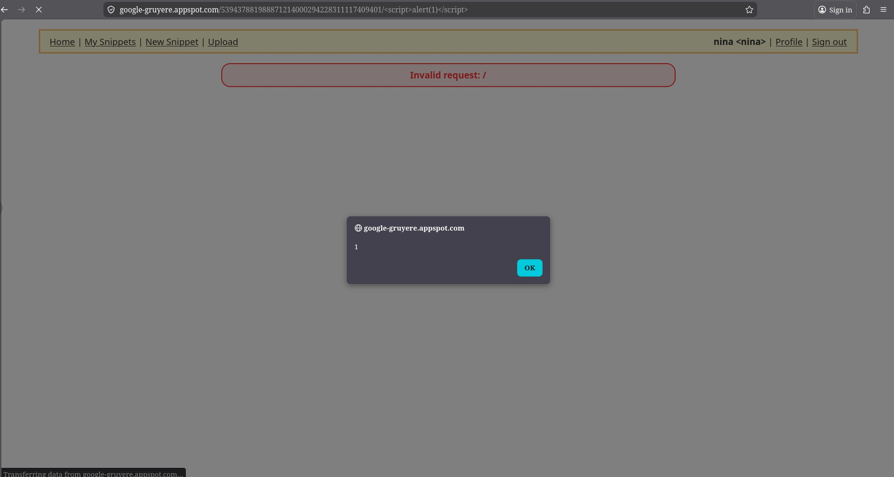  
*Figure 7: "Invalid request" banner with alert "1" — reflected XSS via a crafted URL.*

---

### 1.3 XSS via HTML Attribute

Injecting into an HTML attribute (e.g. a CSS colour value) can smuggle event handlers that execute JavaScript.

**Exploit:** `red' onload='alert(1)' onmouseover='alert(2)`  
**Result:** Script executes when hovering over content.  
**Fix:** Escape quotes and validate attribute values against a strict allowlist (e.g. CSS colour names or `#rrggbb` only).

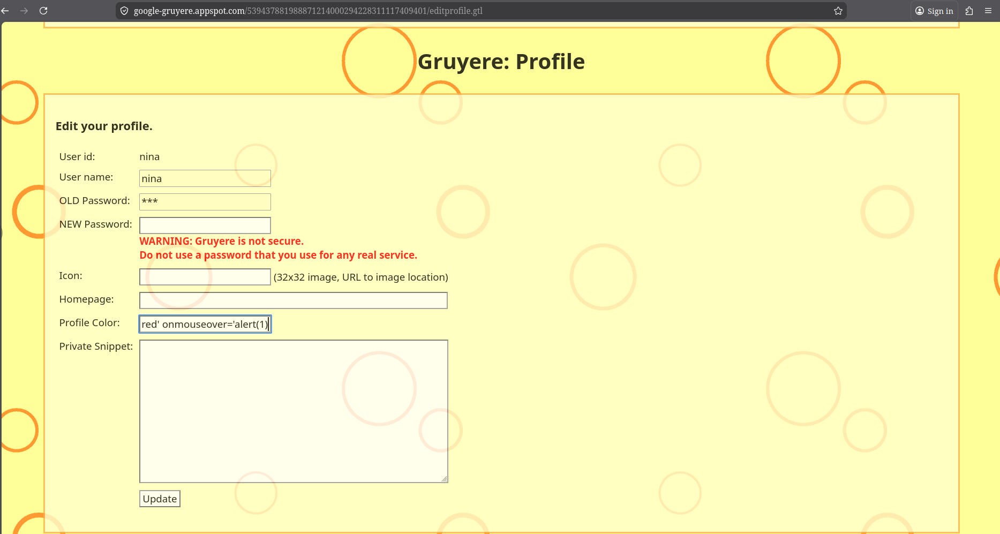  
*Figure 8: XSS payload injected into the Profile Color field.*

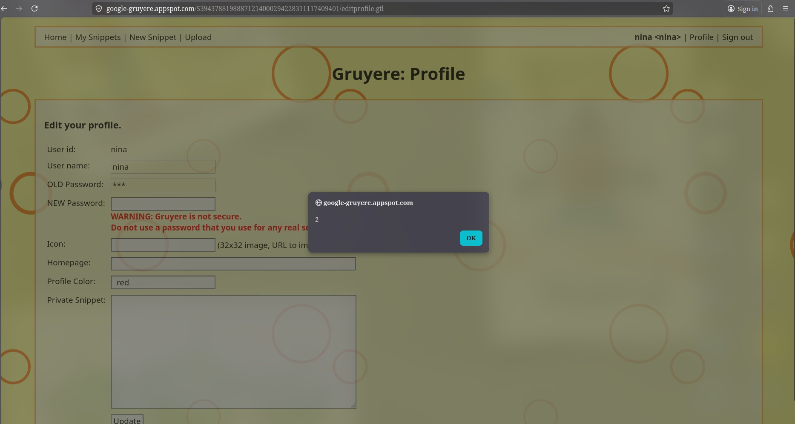  
*Figure 9: Alert "2" confirms the attribute injection executed successfully.*

---

### 1.4 Stored XSS via AJAX

Gruyere's AJAX refresh code uses `eval()` to process server responses, creating an injection vector through stored snippets.

**Exploit:** Hidden `<span style="display:none">` tag containing `alert(1)`, submitted as a snippet.  
**Result:** Script runs every time the page refreshes.  
**Fix:** Avoid `eval()` on server responses. Use `JSON.parse()` on the client side and strip HTML server-side before storage.

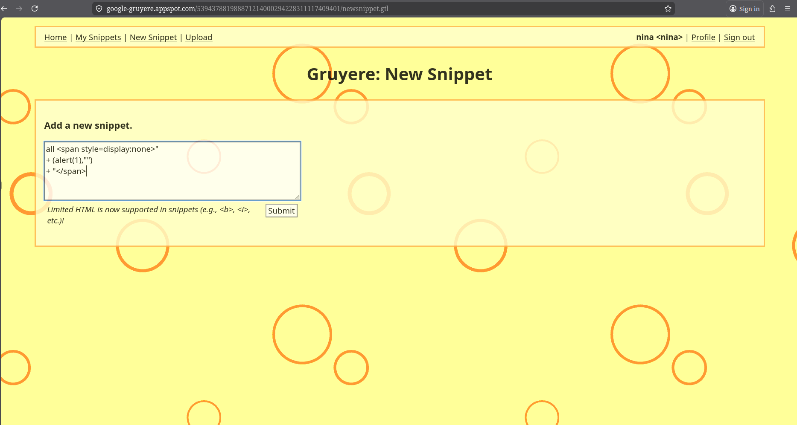  
*Figure 10: Multi-line payload using a hidden span to bypass HTML filtering.*

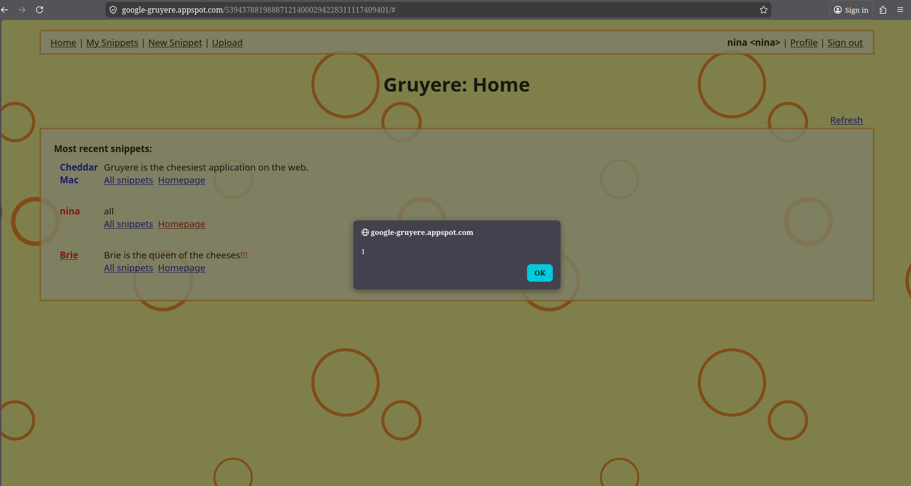  
*Figure 11: Alert "1" fires on every page refresh — stored XSS affects all visitors.*

---

### 1.5 File Upload XSS

Uploading an HTML file and serving it from the same domain allows arbitrary scripts to run with access to the application's cookies.

**Exploit:** A malicious `xss.html` file was created and uploaded. When opened via the application's URL, it executed JavaScript in the browser that read and displayed the session cookies.  
**Result:** The browser exposed the user's GRUYERE token, username, and instance ID — demonstrating a real cookie-theft attack.  
**Fix:** Serve user-uploaded content from a separate domain so scripts cannot access the main application's cookies. Enforce file-type whitelisting (allow only `.txt`, `.png`, `.jpg`, `.jpeg`, `.gif`) and validate file content.

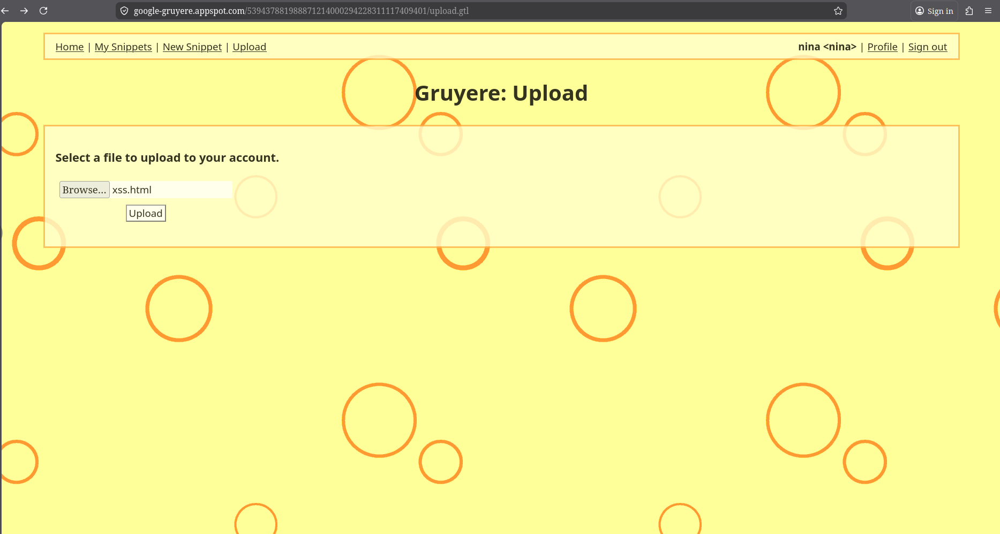  
*Figure 12: xss.html selected for upload on the Gruyere Upload page.*

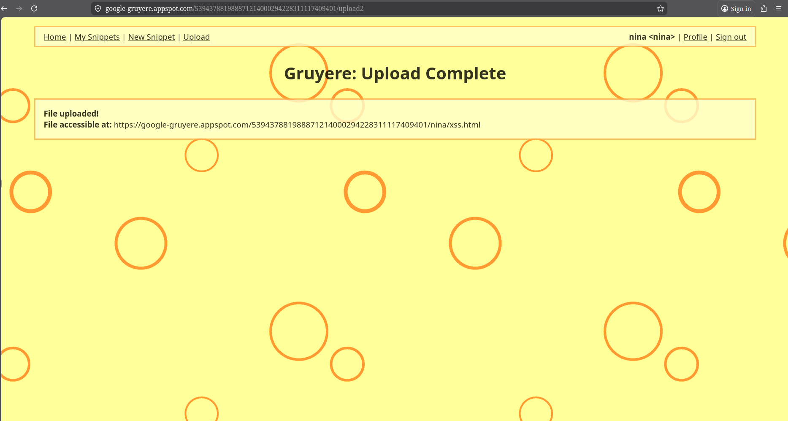  
*Figure 13: Upload confirmed with the file's public URL displayed.*

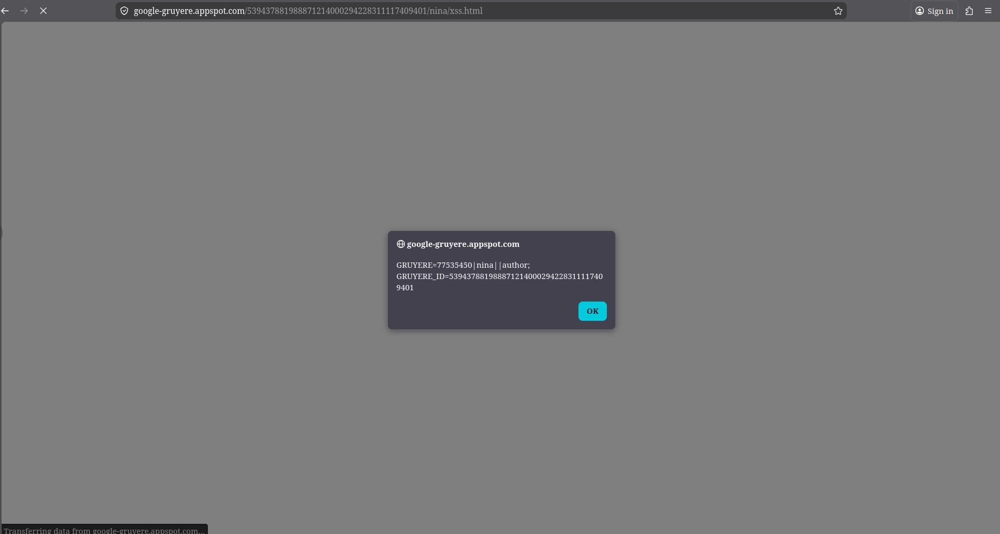  
*Figure 14: Uploaded file exposes session cookies via a browser alert — cookie-theft XSS confirmed.*

---

## 2. Denial of Service (DoS)

A DoS attack attempts to make a server unavailable to legitimate users. Gruyere exposes two unauthenticated administrative endpoints that can be abused for this purpose.

### 2.1 DoS — Quit the Server

**Exploit:** Accessing `/quitserver` in the browser  
**Result:** The server shuts down immediately with no authentication required.  
**Fix:** Restrict all administrative endpoints to authenticated admin users.

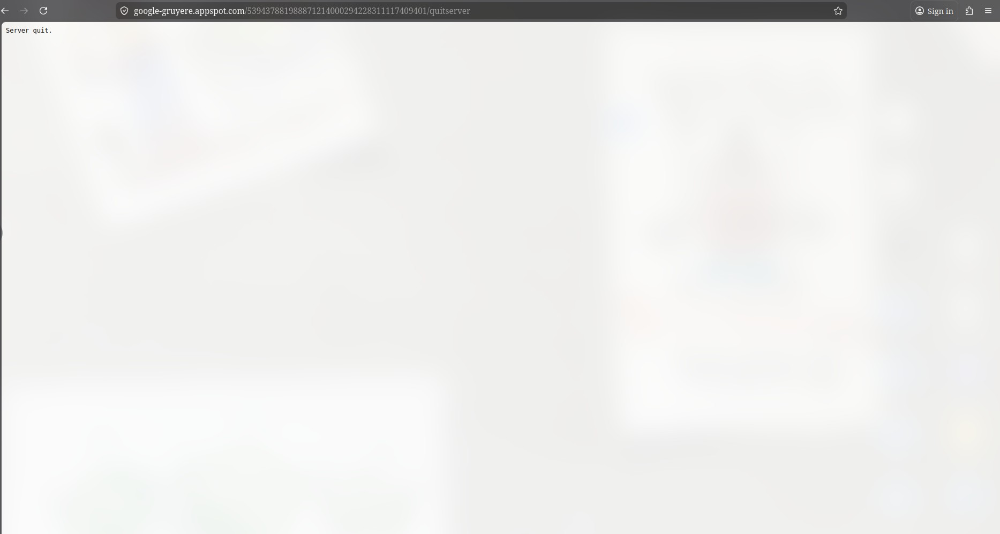  
*Figure 15: Accessing /quitserver shuts the server down — a CSRF-like DoS.*

---

### 2.2 Case-Sensitivity Bypass

**Exploit:** Accessing `/RESET` instead of `/reset`  
**Result:** The security check is bypassed because it only matched lowercase paths; the server resets to default values.  
**Fix:** Normalise request paths to lowercase before applying security checks, and embed security checks inside the dangerous functions themselves so they cannot be bypassed regardless of routing.

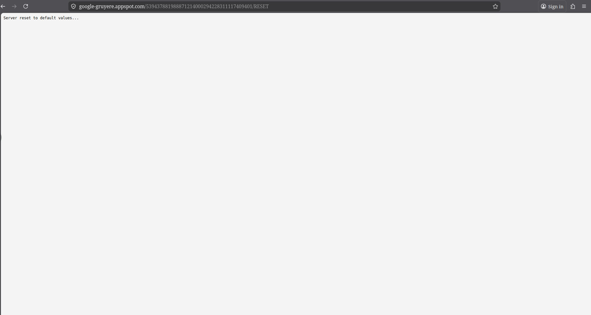  
*Figure 16: /RESET bypasses access controls and resets all server data.*

---

## 3. SQL Injection (Conceptual)

SQL injection allows attackers to embed arbitrary SQL into queries, potentially reading or overwriting an entire database.

**Why not demonstrated:** Gruyere does not use a SQL database and is therefore not susceptible to SQL injection in practice.  
**Fix (general):** Never construct SQL queries by string concatenation. Use parameterised queries or ORM API calls instead.

---

## 4. Buffer Overflow (Conceptual)

Buffer overflow vulnerabilities occur when an application allows user input to write beyond the boundary of a memory buffer, potentially enabling arbitrary code execution. Notable examples include the SQL Slammer, Blaster, and Code Red worms, as well as console hacks on the PS2, Xbox, and Wii.

**Why not demonstrated:** Gruyere is written in Python. Python enforces array bounds and supports arbitrary-precision integers, so typical buffer and integer overflow exploits do not apply.  
**Fix (general):** Use bounds-checked languages or libraries; validate and limit the length of all user input.

---

## Fixes Applied (Source Code)

The following patches were applied to `gruyere.py`:

| Fix | Target | Description |
|-----|--------|-------------|
| FIX-1 | `_DoNewsnippet2` | Strip HTML tags from snippets before storage (Stored XSS) |
| FIX-2 | `_DoBadUrl`, `_SendError` | Pass all user-controlled strings through `_HtmlEscape()` (Reflected XSS) |
| FIX-3 | `_DoSaveprofile` | Validate `color` against a CSS-only regex; restrict `web_site` to `http/https` (Attribute XSS) |
| FIX-4 | AJAX renderer | Replace `eval()` with `JSON.parse()` on the client side (AJAX XSS) |
| FIX-5 | `_DoUpload2` | Whitelist allowed file extensions; reject `.html`, `.js`, etc. (File Upload XSS) |
| FIX-6 | `_DoQuitserver`, `_DoReset` | Require admin cookie; add endpoints to `_PROTECTED_URLS` (DoS) |
| FIX-7 | `HandleRequest` | Normalise path to lowercase before security comparisons (Case-Sensitivity Bypass) |
| FIX-8 | `_CreateCookie` | Replace weak `hash()` with HMAC-SHA256; add `HttpOnly` + `SameSite=Strict` (Cookie Security / CSRF) |

---

## Repository

Source code and fixed implementation: [https://github.com/ninamitchell23/module4-assignment](https://github.com/ninamitchell23/module4-assignment)

---

## References

- Google Gruyere: https://google-gruyere.appspot.com  
- OWASP Top 10: https://owasp.org/www-project-top-ten/
